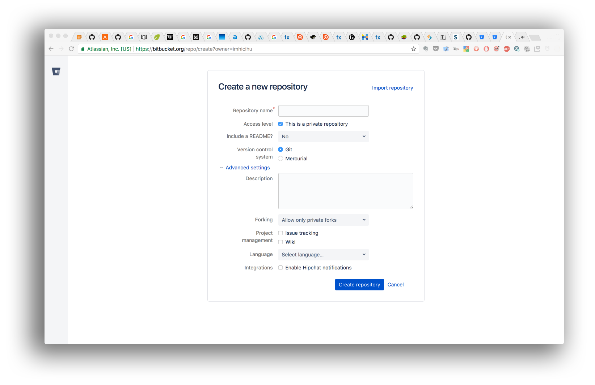

  

---

## Fundamento / [Rationale](README.md)

* Un palimpsesto histórico de bases de datos a lo largo del tiempo, las tecnologías, los flujos de trabajo y las metodologías: expresiones regulares, [scripts de Bash](https://github.com/imhicihu/Automation/tree/master/Homebrew_NPM), [tareas Cron](https://github.com/imhicihu/Automation/tree/master/Cron_jobs), [máquinas virtuales](https://github.com/imhicihu/Automation/blob/master/Virtualization/utm_first_steps_installation.md), AppleScripts, javascripts, scripts de WinIsis, formato `json`... por citar solo algunos ejemplos

  

### ¿Cuál es la razón de ser de este repositorio? ###
* Breve resumen
  - Un palimpsesto de bases de datos que abarca diferentes épocas, tecnologías y personas
 
### Repositorios sobre tiene sus bases este repositorio

* [Terrae-database](https://github.com/imhicihu/Terrae-database)
  
  > Rescate, extracción y limpieza de una antigua base de datos creada en MicroIsis, _aproximadamente_ a mediados de 1990

--- 

* [bibliographical-database-migration](https://github.com/imhicihu/bibliographical-database-migration) de este [repositorio] (https://bitbucket.org/imhicihu/bibliographical-database-migration/src/master/) heredado
    
  > De MicroIsis a Winisis

---

* [Database on mobile device](https://github.com/imhicihu/Database-on-mobile-device)
  
  > Aplicación de base de datos a medida creada exclusivamente en [FileMaker](https://github.com/imhicihu/Database-on-mobile-device/tree/master/downloads) para recopilar datos _in situ_, dada la estructura del edificio, en el que una parte de la biblioteca se encuentra actualmente en el sótano y otra parte en la 5.ª planta. 

---

* [Biblio-offline-searcher](https://github.com/imhicihu/Biblio-offline-searcher)
  
  > Este repositorio muestra un proyecto interno, una solución propia para realizar un seguimiento de los recursos bibliográficos de la colección Reinhardt

### ¿Cómo se configura?
* Resumen de la configuración
  - Lea nuestra última [lista de verificación](Checklist_4_Bitbucket.md)
  - Estos son algunos [fragmentos de código](https://gist.github.com/imhicihu) creados para la ocasión
  - En algún momento, crearemos un [hito](https://jira.atlassian.com/browse/BCLOUD-11528). Y luego, mejorar el camino andado
  
* Dependencias
  - _Cuanto menos, mejor_. Un [lema](https://dictionary.cambridge.org/es/diccionario/ingles/motto) personal
* Instrucciones de implementación
  - No es un "_siga nuestras instrucciones_" obligatorio. Es un ejercicio de "_buenas prácticas_" y sigue nuestras necesidades

### Lineamientos de contribuciones
* Pruebas de escritura
  - [Bifurque](https://es.wikipedia.org/wiki/Bifurcaci%C3%B3n_(desarrollo_de_software)) este repositorio. Abra una [solicitud de mejora](https://www.wikidata.org/wiki/Q68712963) o simplemente comente el flujo de trabajo descrito. Comprueba nuestra [convención de código](Coding_convention.md)
* Revisión de código fuente
  - No hay código. Sólo un ahorrador de tiempo, recordatorios y reglas de buenas prácticas para optimizar el _Tiempo_ (una creación humana)
* Otras guías
  - Este repositorio es una guía _masiva_ / [lista de comprobación](Checklist.md)
  - Existe una [convención de código](Coding_convention.md)

### Problemas

* Compruébelos en [aquí](https://bitbucket.org/imhicihu/good-practices-on-repository-creation/issues)

### Registro de cambios

* Consulte la sección [Commits](https://github.com/imhicihu/Good-practices-on-repository-creation/commits/master) para conocer el estado actual

### ¿Cómo puede contactarnos?
* Administrador del repositorio
    - Contáctese con `imhicihu` arroba `gmail` punto `com`

### Código de conducta

* Consulte nuestro [Código de conducta](codigo_de_conducta.md)

### Legales
* Todas las marcas registradas son propiedad de sus respectivos propietarios

### Licencia
* El contenido de este proyecto está bajo una licencia  
