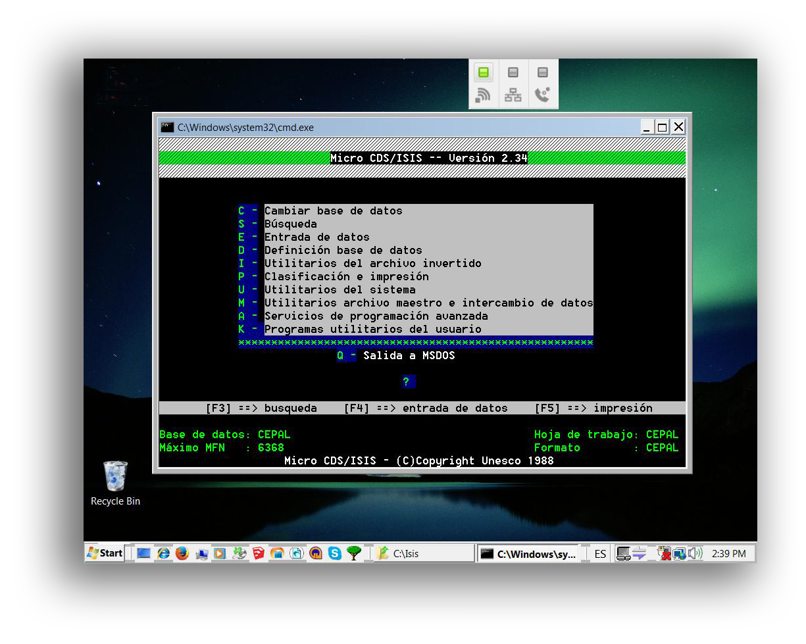
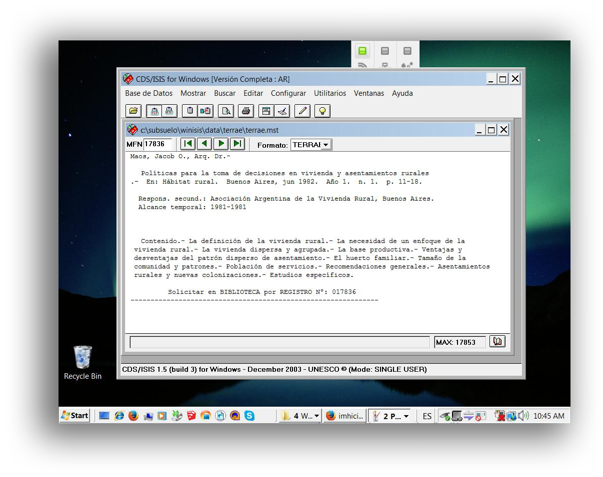
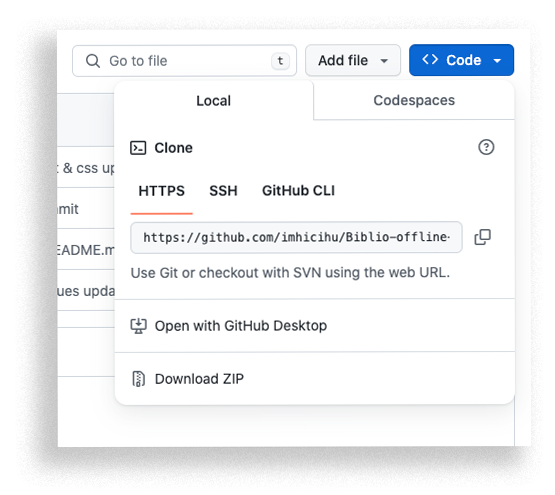

  

---

## Rationale / [Fundamento](LEEME.md)
* An historical palimpsest of databases across times, technologies, workflows and methodologies: regular expressions, [Bash scripts](https://github.com/imhicihu/Automation/tree/master/Homebrew_NPM), [Cron Jobs](https://github.com/imhicihu/Automation/tree/master/Cron_jobs), [virtual machines](https://github.com/imhicihu/Automation/blob/master/Virtualization/utm_first_steps_installation.md), AppleScripts, javascripts, WinIsis scripts, `json` formatting... just to name a few

  

### What is this repository for?

+ Quick summary
    * A palimpsest of databases across times, technologies and personas

### Repositories on which this repository is based

* [Terrae-database](https://github.com/imhicihu/Terrae-database)
  
  > Rescue, mining & clean up of an ancient database made on MicroIsis _circa_ mid-1990

--- 

* [bibliographical-database-migration](https://github.com/imhicihu/bibliographical-database-migration) from this legacy [repository](https://bitbucket.org/imhicihu/bibliographical-database-migration/src/master/)
    
  > MicroIsis to Winisis

---

* [Database on mobile device](https://github.com/imhicihu/Database-on-mobile-device)
  
  > Custom database app created exclusively in [FileMaker](https://github.com/imhicihu/Database-on-mobile-device/tree/master/downloads) to collect data _in situ_ given the building's structure, in which part of the library is currently located in the basement and another part on the 5th floor

---

* [Biblio-offline-searcher](https://github.com/imhicihu/Biblio-offline-searcher)
  
  > This repository shows an inner project, in-house solution to track the bibliographical assets of the Reinhardt collection

### How do I get set up?

+ Summary of set up
    - Read our latest [checklist](kaggle.md)
    - There are some [snippet](https://gist.github.com/imhicihu/48473f953fd17d1eba4aba2bdec023e5) created for the occasion
    - There is a [bibliography](Bibliography.md) to gather information and best practices policies about data cleaning and formatting
+ Deployment instructions
    - No mandatory "_to follow_". It is a "_good practice_" exercise. Database can be transformed in a [webapp](https://github.com/imhicihu/Biblio-searcher_v2) or a [data visualization tool](https://github.com/imhicihu/Biblioteca-over-shiny-app). Imagination is the limit!

### Contribution guidelines

* Writing tests
     - Fork this repo. Open an issue-pull request. Check our [code convention](Coding_convention.md)
     
### Issues

* Check them on [here](https://github.com/imhicihu/Datorum_repositorium/issues)

### Changelog

* Please check the [Commits](https://github.com/imhicihu/Datorum_repositorium/commits/master) section for the current status

### Who do I talk to?

* Repo owner or admin
	 - Contact `imhicihu` at `gmail` dot `com`

### Code of Conduct

* Please, check our [Code of Conduct](code_of_conduct.md)

### Legal

* All trademarks are the property of their respective owners
* This repo support the  initiative

### License

* The content of this project itself is licensed under the [Creative Commons v.1.0](LICENSE)
